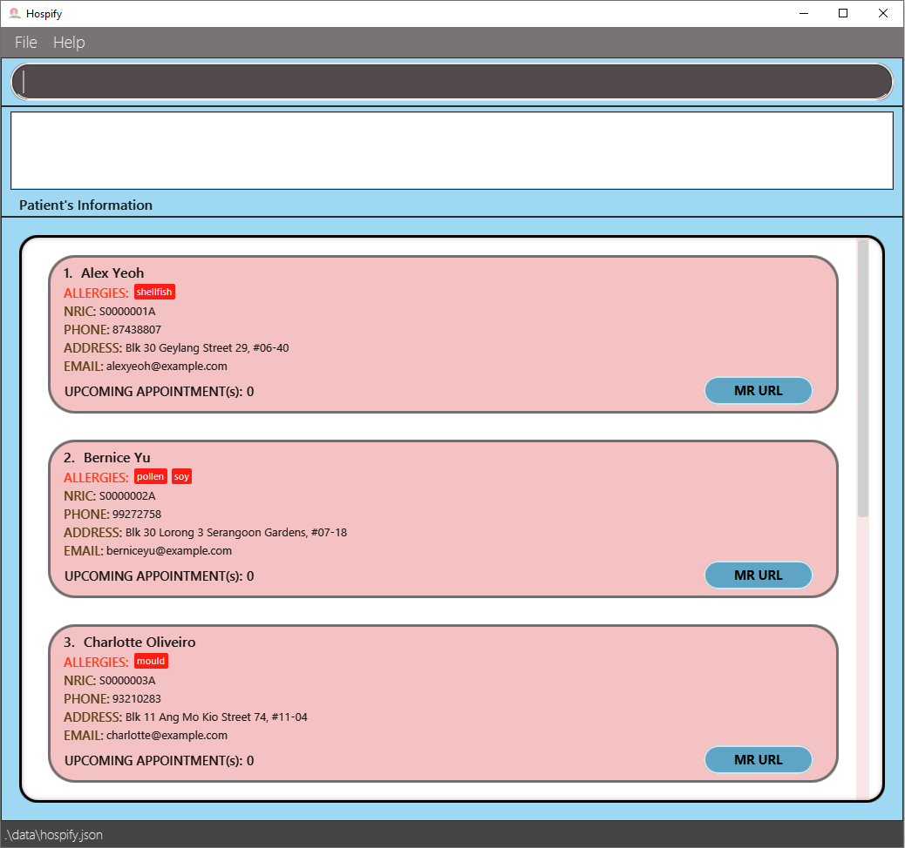

# Hospify

* **Hospify** is a desktop application for a digital medical record management solution to help clinics digitalise their medical records. While it has a GUI, most of the user interactions happen using a CLI (Command Line Interface).
    * It allows users to add, edit, find, delete and sort patients’ medical records and even edit appointment details.
    * **Problem Statement**
        * Many small clinics still use hard copies to store patients' medical records. The database can get really large after many years.
        * It is very expensive and time constraining to archive medical records and find medical records of patients when they revisit. There are also a lot of documents and folders which require a lot of physical space to store.
    * **Solution**
        * We will build an easily accessible and secure system that helps clinics to store their patients’ information and medical records.
        * It will enable the admin staff to easily reach out to the patients and doctors and help them to contact each other.
* For the detailed documentation of this project, see the [Hospify Product Website](https://ay2021s1-cs2103t-w15-3.github.io/tp/).

_Hospify is part of a team project under the CS2103T Software Engineering Module taken at the National University of Singapore._

---
## Installation
Download the `JAR` file from the [latest release](https://github.com/AY2021S1-CS2103T-W15-3/tp/releases) and run on your local device. Ensure that you have [`Java JDK 11`](https://www.oracle.com/java/technologies/javase-jdk11-downloads.html) or above installed in your computer.

---
## Site Map
* [User Guide](https://ay2021s1-cs2103t-w15-3.github.io/tp/UserGuide.html)
* [Developer Guide](https://ay2021s1-cs2103t-w15-3.github.io/tp/DeveloperGuide.html)
* [About Us](https://ay2021s1-cs2103t-w15-3.github.io/tp/AboutUs.html)

---
## Acknowledgements
* Libraries used: [JavaFX](https://openjfx.io/), [Jackson](https://github.com/FasterXML/jackson), [JUnit5](https://github.com/junit-team/junit5)
* This project is based on the AddressBook-Level3 project created by the [SE-EDU initiative](https://se-education.org).
